# Hi there 👋 I'm Tim

I'm a software engineer passionate about helping others grow through mentorship and coaching. I enjoy [publishing technical articles on my blog](https://www.better-simple.com/blog/) and have collected [resources to help you level up](https://www.better-simple.com/learn/). If you're interested in one-on-one mentorship, [let's meet](https://www.better-simple.com/lets-meet/)!

## 📊 An OSS-driven Pokédex

---

## 🚀 Open-source Involvements

### Current Roles

- **Django 6.x [Steering Council](https://www.djangoproject.com/foundation/teams/#steering-council-team)**: Helping guide Django's technical direction (2025–2026)
- **[Django Commons](https://django-commons.org) Administrator**: Helping support maintainers for community-maintained Django packages (2024–present)
- **[Djangonaut Space](https://djangonaut.space) Admin**: Overseeing the mentorship program for Django contributors (2023–present)
- **[Space Reviewer](https://github.com/djangonaut-space/space-reviewers)**: Reviewing contributions in the Djangonaut Space program (2024–present)

### Past Roles

- **[DEFNA Secretary/Director](https://www.defna.org/about/#:~:text=Tim%20Schilling)**: Django Events Foundation North America (2023–2024)
- **DjangoCon US Organizer** ([2023](https://2023.djangocon.us/organizers/#:~:text=Tim%20Schilling)-[2024](https://2024.djangocon.us/organizers/#:~:text=Tim%20Schilling))
- **Google Summer of Code Mentor**: Mentored async support for django-debug-toolbar ([2024](https://summerofcode.withgoogle.com/archive/2024/projects/iXVvyGYp))
- **Djangonaut Space Navigator**: Mentor in [Session 1](https://djangonaut.space/comms/2024/01/17/introducing-our-2024-session-1-officers/), supported Sessions 4 and 5.
- **[Django Discord](https://chat.djangoproject.com) Moderator** (2023)
- **Underdog Devs Mentor**: [Project Underdog program](https://www.underdogdevs.org/project-underdog) (2021–2023)

---

## 💬 Let's Connect

Want to level up your development skills? Let's talk about your goals, challenges, and how mentoring might help. We'll get to know one another and figure out what's next.

👉 **[Schedule our first call!](https://www.better-simple.com/lets-meet/)**

---

## 🛠️ Where I add code these days

I help maintain a few Django packages:

- [django-debug-toolbar](https://github.com/jazzband/django-debug-toolbar/): The essential debugging tool for Django developers
- [wagtail-indymeet](https://github.com/djangonaut-space/wagtail-indymeet): The Djangonaut Space website and application program
- [django-simple-history](https://github.com/jazzband/django-simple-history): Track changes to your models over time
- [django-auth-adfs](https://github.com/snok/django-auth-adfs): Azure AD/ADFS authentication for Django
- [debug-tutorial](https://github.com/tim-schilling/debug-tutorial): A hands-on debugging tutorial
